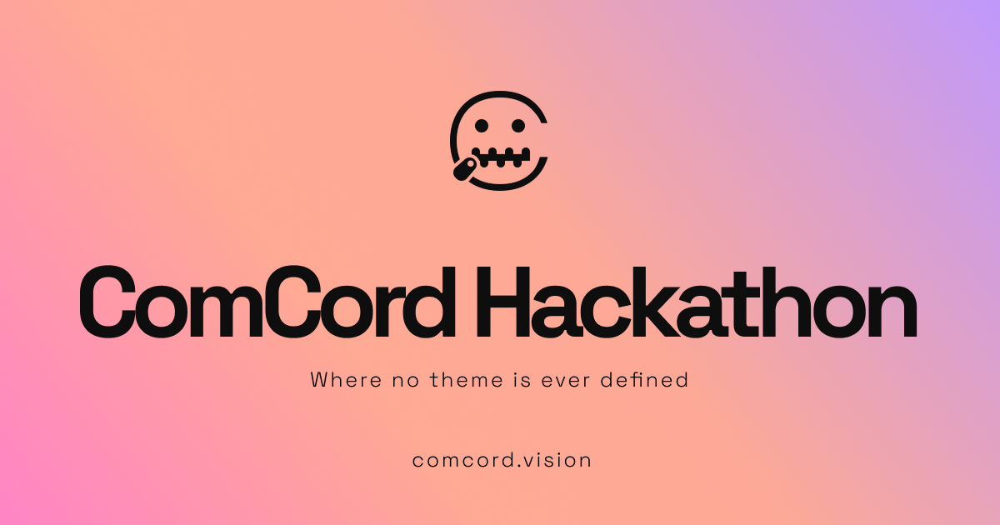

<h1 align="center">
ComCord Hackathon 2024
</h1>

Welcome to the first ComCord Hackathon - where a lot of stupid people do stupid things together, or separately 👀

Note: If the final project is related to DevOps and Kubernetes we would like to invite you to [Kubernetes London in June](https://guild.host/events/kubernetesuwubernetes-y2gk4w). 

### Theme

- Launching rocket

### Project details 
You can interpret the theme however you want. There is no limitation on what you can build and where your imagination wants to go. Regardless it is a Kubernetes Operator, npm package, infrastructure tool for the web to speed up development or an app that helps you shop tools to build toy Rockets. There is no limitation on what languages you'd like to use as long as it is functional - writing something in Javascript/Typescript, [Gleam](https://gleam.run/), [Zig](https://gleam.run/), [Rust](https://www.rust-lang.org/), [Lisp](https://lisp-lang.org/) or [Ocamel](https://ocaml.org/) is absolutely fantastic. **We will invite judges who understand you.** If you wish to continue with the idea of OSS for OSS but theme it in some way close to "Launching Rocket" - you totally can!

Tips: Write a good documentation for it if possible - we want you to know that documentation is critical for something that lasts. **Participants will be presenting their projects on a Twitch stream at the end.**

### Judge 

- [Trav](https://twitter.com/techsavvytravvy): Over a decade of experience - Senior Developer/Tech Lead at Universal Music Group. Twitch Streamer. He forked [Crablang](https://github.com/crablang). 
- [Zeu](https://twitter.com/zeu_dev): Software engineer at [OpenSauced](https://opensauced.pizza/). Twitch Streamer. Writes a lot of Svelte. 
- A list of secret judges/twitch streamers is onboarding soon...stay tuned!

### Team size
 
 2-3

 You can find your team member from ComCord but you can also find friends outside of ComCord. If you can't -- let us [discord server](https://discord.gg/R49Xqt9Ys2) know and we will help you allocate one. 

### Prizes
- Most difficult to complete
- The stupidest trophy
- The prettiest UI
- Mostly horrible
- The best of all

### Starting date
- 8th May
- We'd expect you to submit your [team member](https://github.com/zmzlois/comcord-hackathon-2024/issues/new?assignees=&labels=team+submission&projects=&template=team-formation--team-name-.md&title=Team:+%5Bname%5D) here within one week after the hackathon starts. 

### Deadline
- 10th June

### Submission Criteria
- The final project should be in one Github repository with an explanation of the project structure. 
- Each team will present the project on Twitch stream, explain the functionality, or demo its usage. 
- Each repository will be showcased with listed team members on this README.md after the deadline. 
- The GitHub repository link should be sent over to Lois([discord: comcord](https://discord.gg/R49Xqt9Ys2)) before the deadline. 

### Relevant Links

- [Discord Server](https://discord.gg/UDH3FaH2)

### Rules
- Team size: Your team size must be between 2 to 3 people
- Project Scope: Teams can work on any project within the given theme or problem statement. The scope can be limited to a specific technology or platform based on the event's guidelines.
- Time Limit: The Hackathon will have a specific time limit.
The use of pre-existing code or projects is not allowed, except for open-source libraries or frameworks.
- Code Ownership: All code developed during the Hackathon should be the original work of the team. Participants cannot use code or assets created by someone else without proper permissions or licenses.
- Collaboration: Teams are encouraged to collaborate and seek help from mentors or organizers, but cross-team collaboration is not allowed during the competition.
- Presentation: Each team will have to present their project to the judging panel. The presentation should demonstrate the functionality and features of the project, as well as any unique or innovative aspects.
- Judging Criteria: The judging criteria for the Hackathon will be clearly communicated to the participants before the event. The result by the judge will be final. It may include aspects such as innovation, technical implementation, user experience, scalability, and relevance to the theme.
- Fair Play: Participants must adhere to ethical standards and abide by the rules and regulations set by the organizers. Any form of cheating, plagiarism, or unfair practices will result in immediate disqualification.
Intellectual Property: Participants retain full ownership of the intellectual property rights to their projects. However, organizers may request participants to share their code or project details for promotional or showcase purposes.
- Code Submission: Teams must submit their code and project documentation before the specified deadline. Late submissions may result in penalties or disqualification.
- Code Validation: Organizers may conduct code validation to ensure that the project was developed within the given time frame and complies with the rules and regulations.
- Code Sharing: Participants are encouraged to share their code and projects with the wider community after the Hackathon. Open sourcing or publishing the code on platforms like GitHub is often appreciated.
- Code of Conduct: Participants should adhere to a code of conduct that promotes inclusivity, respect, and professionalism. Any form of harassment, discrimination, or inappropriate behaviour will not be tolerated.
- Prizes and Awards: The Hackathon will offer prizes or awards to winning teams based on the judging criteria. The prizes can include cash, mentorship opportunities, incubation or acceleration programs, or other incentives outlined by the organizers.
- Disputes and Arbitration: In case of any disputes or concerns, the decision of the organizers and judging panel will be final. Any disagreements or issues should be resolved through an arbitration process outlined by the organizers.
- Liability: The organizers and sponsors of the Hackathon hold no liability for any damages, losses, or injuries incurred during the event. Participants are responsible for their own safety, equipment, and actions.
- Changes to the Rules: Organizers reserve the right to make changes to the Hackathon rules, format, or prizes at any time. Any modifications will be communicated to the participants in a clear and timely manner.
- Consent and Media Release: Participants may be required to provide consent for their photographs, videos, or project details to be used by the organizers for promotional or media purposes.

